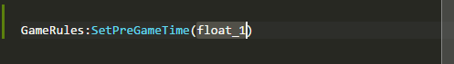
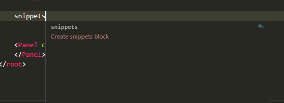

# Dota-Reborn-Code

## Working in progress

- [x] Lua: Function and enum snippets;

    

    

- [x] JavaScript: Function and enum snippets;

    

- [x] XML: Snippets;

    

- [x] KV: Syntax, highlighting and ~~snippets~~;

    

## Installation

### Use Visual Studio Code Extension Market 

1. Install [Visual studio code](https://code.visualstudio.com/);

    

2. Open it;
3. Click Extension tab and search for `dota2 reborn code`;
    
    

4. Click install & activate and enjoy!

### Manual

1. Clone or download & extract to any place;

2. Cut the directory of this project into `%USER_PROFILE%\.vscode\extension`;

3. Success!